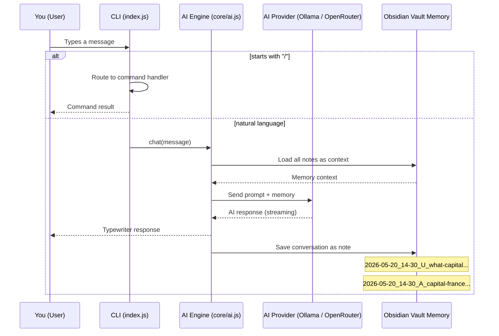
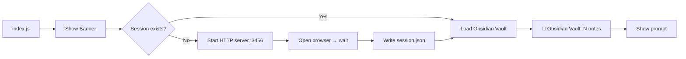

# Open Friday Architecture

## System Overview

```mermaid
flowchart TB
    User([User]) --> CLI[CLI Interface\nindex.js]
    
    subgraph CLI_Layer ["CLI Layer"]
        CLI --> Auth{Authenticated?}
        Auth -- No --> Login[Login via Browser\nlocalhost:3456]
        Login --> Session[Session Created\ncore/session.json]
        Auth -- Yes --> Session
        Session --> Prompt[OpenFriday ❯ Prompt]
    end

    subgraph Command_System ["Command System"]
        Prompt --> Router{Route Input}
        Router -- "/command" --> Registry[Command Registry\ncommands/registry.js]
        Registry --> CmdHandler[Command Handlers\ncommands/index.js]
        CmdHandler --> CmdResult[Execute & Return]
        
        Router -- "natural language" --> AI_Chat
    end

    subgraph AI_Engine ["AI Engine"]
        AI_Chat[Chat Handler\ncore/builtin.js] --> Provider{Route by\nAI_PROVIDER}
        
        Provider -- "ollama" --> Ollama[Ollama Client\ncore/ai.js: ollamaRequest]
        Provider -- "openrouter" --> OpenRouter[OpenRouter Client\ncore/ai.js: openRouterRequest]
        
        Ollama --> OllamaHealth{Health Check\n/api/tags}
        OllamaHealth -- "❌ Offline" --> Fallback[Rule-Based Fallback\ncore/builtin.js]
        OllamaHealth -- "✅ Online" --> AI_Response
        
        OpenRouter --> ORHealth{API Key Set?}
        ORHealth -- "❌ No Key" --> Fallback
        ORHealth -- "✅ Has Key" --> AI_Response
        
        AI_Response[Stream / Non-Stream Response] --> User
    end

    subgraph Memory_System ["Memory System"]
        direction TB
        Startup[Startup / Login] --> LoadVault[Load Obsidian Vault\ncore/obsidian-memory.js]
        LoadVault --> Context[Inject Notes as\nAI Context]
        
        AI_Conversation[AI Conversation] --> SaveNote[Save to Vault\nYYYY-MM-DD_HH-MM-SS_Role_Description.md]
        SaveNote --> Vault[Obsidian Vault\nOpenFriday/]
        
        Vault --> MemoryCmd[/memory command\nlist / search / save / summary]
        MemoryCmd --> Search[Full-Text Search]
        MemoryCmd --> List[List All Notes]
        MemoryCmd --> SaveStruct[Save Structured Memory]
    end

    subgraph Agent_System ["Autonomous Agent"]
        Agent[/agent command\ncore/agent.js] --> AgentLoop{Sense → Plan → Act → Verify}
        AgentLoop --> ToolUse[Tool Calls\n<tool>command args</tool>]
        ToolUse --> Registry
        AgentLoop --> AgentResult[Task Complete / Timeout]
    end

    %% Cross-linking
    AI_Chat --> Context
    AI_Conversation --> SaveNote
    Vault --> Context
    
    style User fill:#6366f1,color:#fff,stroke:#4f46e5
    style CLI fill:#1e293b,color:#f1f5f9,stroke:#6366f1
    style AI_Response fill:#10b981,color:#fff,stroke:#059669
    style Vault fill:#f59e0b,color:#fff,stroke:#d97706
    style Fallback fill:#ef4444,color:#fff,stroke:#dc2626
```

## Data Flow



## File Structure

```
openFRIDAY/
├── index.js                  # CLI entry point + readline UI
├── config.json               # Legacy config (ai.js now uses .env)
├── package.json
├── .env                      # AI_PROVIDER, keys, vault path
├── .env.example
│
├── core/
│   ├── ai.js                 # Multi-provider AI client (Ollama + OpenRouter)
│   ├── builtin.js            # Rule-based fallback, intent classifier, code gen
│   ├── agent.js              # Autonomous coding agent (Sense → Plan → Act → Verify)
│   ├── obsidian-memory.js    # Obsidian vault CRUD (load, save, search, list)
│   ├── auth.js               # User authentication (login/logout/session)
│   ├── auth-server.js        # HTTP login server (localhost:3456)
│   ├── env.js                # .env loader (provider, model, vault path)
│   ├── session.json          # Active session
│   └── conversation.json     # Short-term conversation window
│
├── commands/
│   ├── index.js              # All /command definitions
│   └── registry.js           # Command registration + fuzzy search
│
├── OpenFriday/               # 📓 Obsidian Vault (AI's persistent memory)
│   ├── .obsidian/            # Obsidian editor config
│   ├── Welcome.md
│   └── Memory/               # Auto-saved conversation notes
│       ├── 2026-05-20_14-30_U_what-capital...
│       ├── 2026-05-20_14-30_A_capital-france...
│       └── 2026-05-20_14-31_prefs...
│
├── webui/                    # Login page assets
│   ├── login.html
│   ├── script.js
│   └── styles.css
│
├── utils/
│   ├── constants.js          # Default values
│   ├── format.js
│   └── typing.js
│
└── docs/
    └── architecture.md       # This file
```

## Startup Sequence



## AI Provider Configuration (.env)

```env
# ─── AI Provider ───
AI_PROVIDER=ollama              # ollama | openrouter | builtin

# Ollama (local, no key needed)
OLLAMA_BASE_URL=http://127.0.0.1:11434
OLLAMA_MODEL=llama3.2:latest

# OpenRouter (cloud, needs API key)
# OPENROUTER_API_KEY=sk-...
# OPENROUTER_MODEL=openai/gpt-4o-mini

# Obsidian Vault path (default: ./OpenFriday)
# OBSIDIAN_VAULT_PATH=
```
